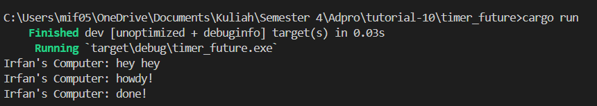
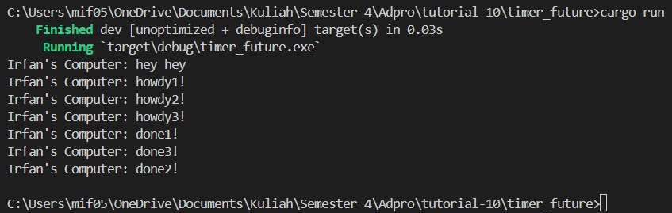
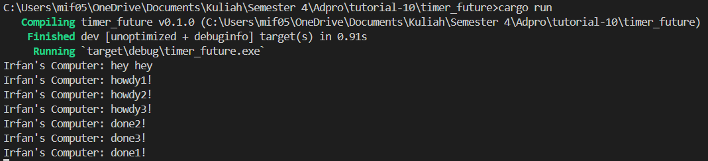
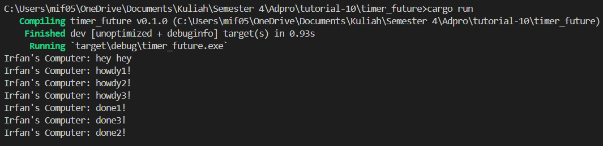

## 1.2. Understanding how it works.

Berdasarkan Gambar di atas, yang pertama muncul di output adalah "Irfan's Computer: hey hey!" karena baris ini dieksekusi sebelum memanggil fungsi drop(spawner) dan executor.run(). Artinya, pesan ini dicetak langsung pada thread utama sebelum executor mulai menjalankan task yang ada di dalam spawner. Ketika executor dimulai, task yang telah disiapkan sebelumnya baru akan dijalankan. Output kemudian akan menunjukkan "Irfan's Computer: howdy!" dan setelah menunggu dua detik, akan menampilkan "Irfan's Computer: done!". Dengan demikian, "Irfan's Computer: hey hey!" muncul pertama karena dieksekusi langsung di thread utama sebelum executor menjalankan task asinkron yang telah diatur.

## 1.3. Multiple Spawn and removing drop
1. 3x Spawn dengan drop
    
2. 3x Spawn tanpa drop
    
3. 3x Spawn dengan drop
    

Dari lampiran tersebut, tampaknya ada beberapa task yang dijadwalkan melalui spawner dan dikelola oleh sebuah executor. Penggunaan drop(spawner) memberitahu executor bahwa tidak akan ada task baru yang masuk, sehingga memungkinkan executor untuk berhenti setelah menyelesaikan semua task yang ada dalam antrian. Sebaliknya, jika drop(spawner) tidak digunakan atau dikomentari, executor tidak akan mendapatkan informasi bahwa tidak ada lagi task yang akan datang, sehingga akan terus menunggu task baru yang tidak akan pernah muncul, yang bisa menyebabkan program tidak pernah selesai.

Selanjutnya, urutan keluarnya "done" bisa berbeda karena setiap task memiliki waktu tunggu yang sama, yaitu dua detik. Oleh karena itu, urutan penyelesaian task setelah waktu tunggu ini bergantung pada bagaimana executor menjadwalkan task tersebut. Hal ini bisa menyebabkan task dijalankan dalam urutan yang tidak terprediksi karena sifat asinkron dan konkurensi dari sistem.
   
